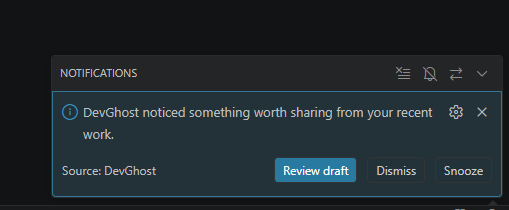
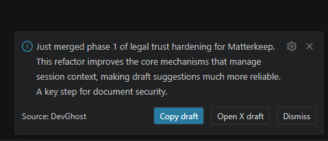
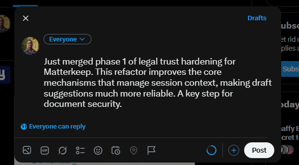

# DevGhost

DevGhost is a VS Code extension that watches real coding activity and suggests build-in-public drafts when it detects meaningful progress. Every draft is shown for review first. DevGhost never posts automatically.

This is a beta build.

## Demo

[](https://youtu.be/K5C65atH3Xk)

## What it does

- Watches local coding signals: file edits, saves, terminal commands, commit activity, and session timing
- Scores your session locally before deciding whether a draft is worth suggesting
- Suggests a draft for review when the signal is strong enough
- Lets you copy a draft or open a draft on X only after you choose to
- Never posts automatically

## What it does not do

- Does not post to X, Twitter, or any platform automatically
- Does not send code or context to AI on every save or edit
- Does not have a cloud mode
- Does not manage billing or API quotas
- Does not replace your judgment

## What DevGhost watches locally

DevGhost tracks the following signals in memory and in VS Code's workspaceState for the current workspace:

- Which files you edit and save (file paths and language IDs, not file content)
- Terminal command exit codes (success or failure) to detect friction and recovery
- Session timing and active coding duration
- Git commit hashes, messages, and file change counts (read from your local git repo)
- Your current focus and project name (which you set manually)

DevGhost does not read file content line by line. When you choose to generate a draft, selected context is assembled and sent to Gemini. See below.

## What gets sent to Gemini

Gemini is only called when a draft is generated — either when you trigger one manually or when DevGhost decides the session signal is strong enough. DevGhost never sends anything to Gemini on every save or edit.

Depending on which draft flow runs, the following context may be included in the request:

- Your project name, goal, and current focus (set by you)
- Recent commit messages and change stats (additions, deletions, file count)
- Changed file paths and file type summaries
- Your baseline project summary (generated when you ran Set Up Project)
- Terminal command outcomes (exit codes and command names — not full output)
- Function, class, and interface names extracted from the active file

For the following flows, DevGhost also includes selected git diff excerpts:

- **Draft From Recent Work** (`DevGhost: Draft From Recent Work`): sends uncommitted changes (`git diff HEAD`) for the active workspace, up to approximately 8,000 characters
- **Deep work wrap-up** (fires automatically after a long focused session): sends diff excerpts for the three most-modified files since the last commit, up to approximately 15,000 characters combined

All context passes through a sanitizer before being sent. The sanitizer removes lines that match common secret patterns (API keys, tokens, passwords, database URLs), redacts absolute file paths, skips files in sensitive locations (`.env`, `.pem`, `.key`, credential files), and strips binary content. Diffs are also truncated at a size limit.

**Sanitization reduces risk but is not a guarantee.** Use DevGhost on personal or non-client repos until you are comfortable with what is included in requests.

## Privacy and trust

- You bring your own Gemini API key
- The key is stored in VS Code's SecretStorage — not in any file, not in logs, not sent anywhere by DevGhost
- Project context and activity history are stored locally in VS Code's workspaceState, isolated per workspace
- Gemini is only called when a draft is generated, not on every save or edit
- Drafts are always shown for review before any action is taken
- DevGhost never posts automatically
- There is no cloud sync or external DevGhost server
- DevGhost does not sell or share your data

## How to clear your AI key

Run `DevGhost: Clear AI Key` from the command palette. The key is removed from SecretStorage immediately.

## How to reset project context and activity

- `DevGhost: Reset Project Context` — clears the project setup and baseline summary for this workspace
- `DevGhost: Reset Recent Activity` — clears the in-memory session signals without affecting the project setup

## Supported editors

- VS Code
- Cursor
- Antigravity

## Known limitations

- Requires a personal Gemini API key (free tier available)
- Sanitization reduces risk but does not guarantee all sensitive content is excluded
- No cloud sync
- No billing management
- No posting to any platform

## Screenshots






## Quick start

1. Install the VSIX.
2. Open a personal repo.
3. Run `DevGhost: Add AI Key` and enter your Gemini key.
4. Run `DevGhost: Set Up Project` to set up your project context.
5. Run `DevGhost: Set Current Focus` to tell DevGhost what you are working on.
6. Code normally.
7. When DevGhost detects enough signal, it will suggest a draft for review.

## Support

- [Open an issue on GitHub](https://github.com/Ticoworld/DevGhost/issues) for bug reports, questions, or feature requests
- See [SUPPORT.md](SUPPORT.md) for what to include in a report

## Local development

```bash
npm install
npm run compile
```

- Press `F5` in VS Code to launch the Extension Development Host
- Run `npm run package` to build a VSIX
