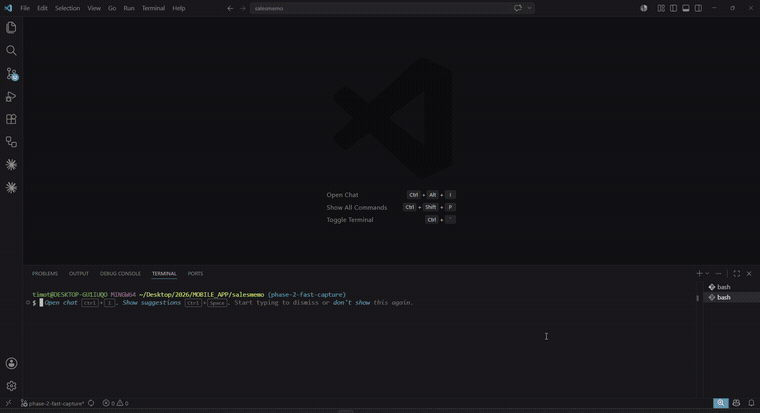

# DevGhost

DevGhost is a Cloud-first VS Code extension that watches real coding activity and suggests build-in-public posts for review. DevGhost Cloud is the default path. Every post is shown for review first, and DevGhost never posts automatically.

This is a beta build.

## Demo

[](https://youtu.be/K5C65atH3Xk)

[Watch on YouTube](https://youtu.be/K5C65atH3Xk)

## What it does

- Watches local coding signals: file edits, saves, terminal commands, commit activity, and session timing
- Builds rich sanitized context for DevGhost Cloud when it suggests a draft
- Gives you 3 free Cloud drafts per rolling 24-hour window
- Suggests a post for review when the signal is strong enough
- Lets you copy a post or open it in Twitter/X only after you choose to
- Never posts automatically

## What it does not do

- Does not require a Gemini/BYOK key for normal use
- Does not post to X, Twitter, or any platform automatically
- Does not store raw code, raw diffs, prompt text, Gemini responses, final post text, terminal output, file contents, or absolute paths
- Does not replace your judgment

## Quick start

1. Install the VSIX.
2. Open a repo you want to write about.
3. Open the workspace and let DevGhost watch your work.
4. Use `DevGhost: Edit Project Details` if you want to refine the workspace setup.
5. Use `DevGhost: Write a Post Now` when you want a manual post.
6. Review the post, then choose `Copy post`, `Open in Twitter/X`, or `Dismiss`.

## What gets sent to DevGhost Cloud

DevGhost Cloud is called only when a draft is generated. The extension sends rich sanitized context so drafts can be specific and useful, but the backend is designed to keep only metadata.

The context may include:

- Project summary
- Current focus
- Trigger type
- Session duration
- Commit messages
- Changed relative file paths
- File type summary
- Active symbols
- Failed and successful command names
- Short friction summary
- Selected sanitized diff excerpts when needed
- Recent draft angle memory
- Recent topics already posted
- Repeated phrases to avoid

Selected sanitized diff excerpts may be sent transiently for generation, but they are not stored.

All context passes through a sanitizer before being sent. The sanitizer removes common secret patterns, skips binary content, and blocks absolute paths and other unsafe content. Sanitization reduces risk, but it is not a guarantee.

## Privacy and trust

- Gemini key lives only in Vercel environment variables and is not required in the extension setup flow
- Neon stores metadata only: device id, quota counts, draft event metadata, feedback metadata, topic and angle summaries, repeated topic tags, timestamps, and error codes
- DevGhost does not store raw code, raw diffs, prompt text, Gemini response text, final post text, terminal output, file contents, or absolute paths
- Drafts are always shown for review before any action is taken
- DevGhost never posts automatically
- BYOK commands still exist, but only as hidden legacy or advanced commands

## Legacy Gemini setup

If you already rely on BYOK, those commands are still available for advanced use:

- `DevGhost: Add AI Key (Legacy)`
- `DevGhost: Clear AI Key (Legacy)`
- `DevGhost: Check AI Setup (Legacy)`

They are not part of the main onboarding flow.

## How to reset project context and activity

- `DevGhost: Reset Project Context` - clears the project setup and baseline summary for this workspace
- `DevGhost: Reset Recent Activity` - clears the in-memory session signals without affecting the project setup

## Supported editors

- VS Code
- Cursor
- Antigravity

## Known limitations

- Cloud drafts are limited to 3 free generations per rolling 24-hour window
- Sanitization reduces risk but does not guarantee all sensitive content is excluded
- Legacy Gemini/BYOK is hidden from the normal product surface
- No posting to any platform automatically

## Screenshots


## Support

- [Open an issue on GitHub](https://github.com/Ticoworld/DevGhost/issues) for bug reports, questions, or feature requests
- See [SUPPORT.md](SUPPORT.md) for what to include in a report

## Local development

```bash
npm install
npm run compile
```

- Press `F5` in VS Code to launch the Extension Development Host
- Run `npm run package` to build a VSIX
